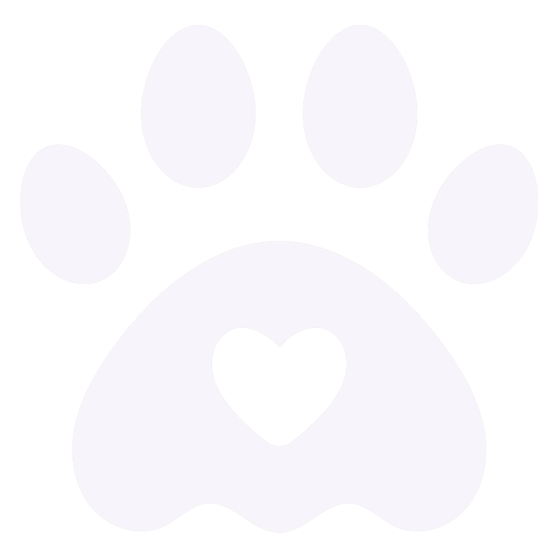

  
  

## De Gatos & Perros Web E-Commerce

De Gatos y Perros es un ecommerce especializado en la venta de productos para mascotas, centrado especialmente en gatos y perros. El catálogo está organizado en diversas categorías y subcategorías que incluyen alimentos, accesorios, juguetes y productos de cuidado. 

Con un enfoque en la calidad y la variedad, la idea es ofrecer al cliente una llamativa selección de artículos que satisfacen las necesidades específicas de sus mascotas. Utilizando las últimas tecnologías y una interfaz amigable, facilitando una experiencia de compra intuitiva y personalizada para todos los amantes de los animales.

### Avance del proyecto
Este proyecto está recién en sus inicios y es parte de uno de los proyectos solicitados por el curso de Next impartido por Coderhouse. Manejado con tecnologías principales como **Next**, **React**, **Javascript**, **Tailwind CSS** y **Sass modules**. Los productos que se muestran en el sitio son llamados a través de una mockdata.

El diseño es de mi autoría y todas las imágenes que se han usado en el proyecto han sido recopiladas de distintos lugares y otras editadas por mi a través de Photoshop mediante IA generative. Sitio totalmente responsive.

### Enlaces del proyecto
Repositorio oficial: [GitHub](https://github.com/paaolaola/next-paola-gonzalez)

Deploy: [De Gatos & Perros](https://degatosyperros.vercel.app/)